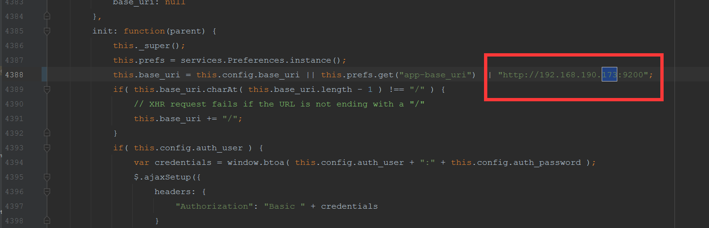
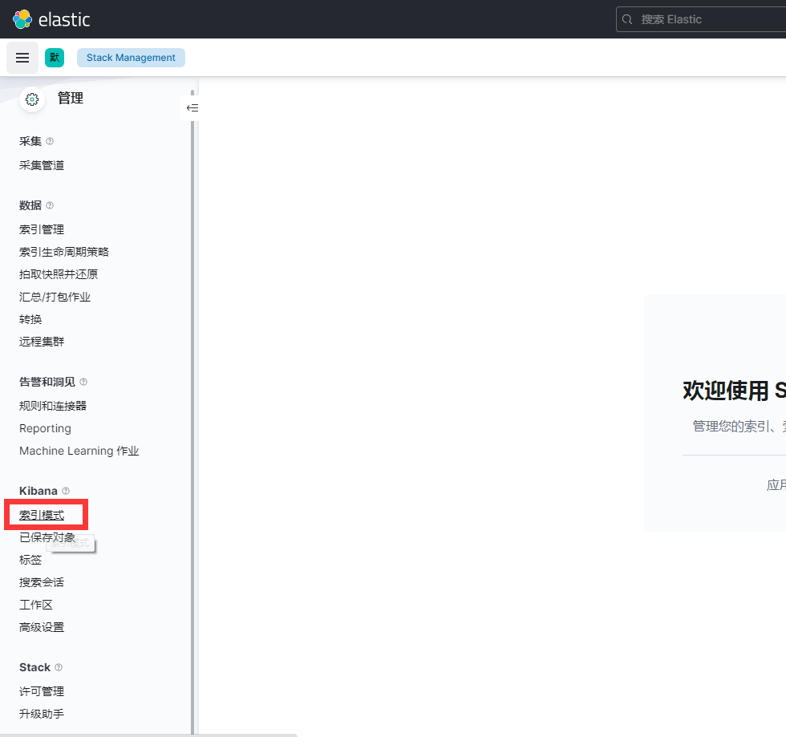
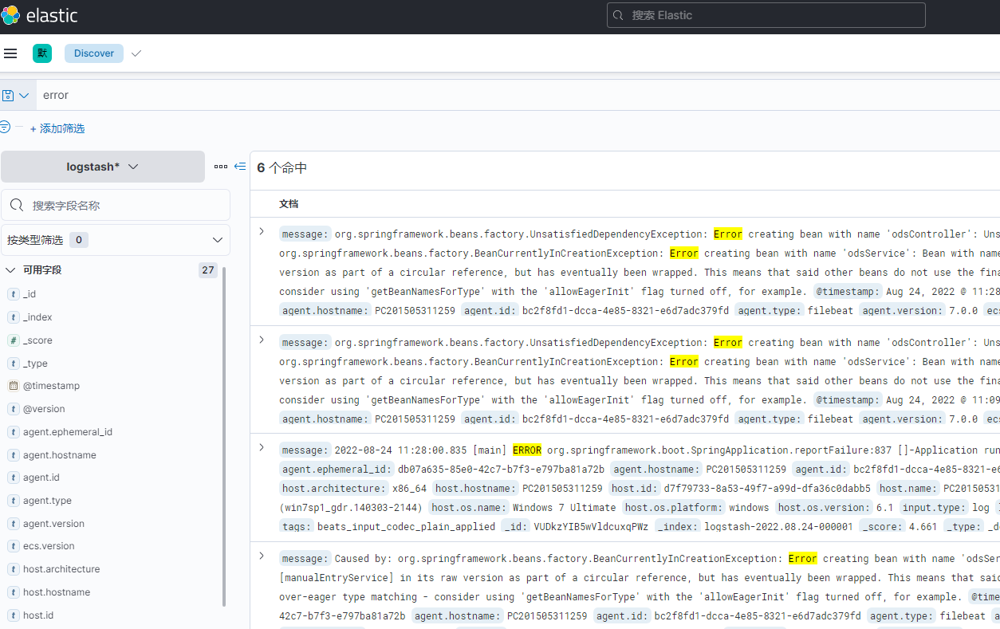

## 下载所需要的包
```
1 Elastic 的官方网站：https://www.elastic.co/
2 ElasticSearch7.16.2 ：https://artifacts.elastic.co/downloads/elasticsearch/elasticsearch-7.16.2-windows-x86_64.zip
3 Logstash7.16.2：https://artifacts.elastic.co/downloads/logstash/logstash-7.16.2-windows-x86_64.zip
4 kibana7.16.2：https://artifacts.elastic.co/downloads/kibana/kibana-7.16.2-linux-windows-x86_64.zip
5 filebeat7.16.2:https://artifacts.elastic.co/downloads/beats/filebeat/filebeat-7.16.2-windows-x86_64.zip
6 以上版本均为7.16.2
```

### 一、安装部署ElasticSearch
1.修改配置参数  /config/elasticsearch.yml
```
1 #集群名称
2 cluster.name: es
3 #集群节点名称
4 node.name: node-173
5 #绑定的IP地址
6 network.host: 192.168.190.173
7 #HTTP的端口号
8 http.port: 9200
9 #新节点用于加入集群的主节点列表
10 discovery.seed_hosts: ["192.168.190.173"]
11 #bootstrap集群的初始列表
12 cluster.initial_master_nodes: ["node-173"]
13 path.data=指向一个存储空间比较大的分区
14 path.logs=指向一个存储空间比较大的分区
```
2.启动  /bin/elasticsearch.bat

启动后访问 192.168.190.173:9200,出现以下所示即启动成功
```
{
  "name" : "node-173",
  "cluster_name" : "es",
  "cluster_uuid" : "fMjQC2VwTJmZQzR3e23aEw",
  "version" : {
    "number" : "7.16.2",
    "build_flavor" : "default",
    "build_type" : "zip",
    "build_hash" : "2b937c44140b6559905130a8650c64dbd0879cfb",
    "build_date" : "2021-12-18T19:42:46.604893745Z",
    "build_snapshot" : false,
    "lucene_version" : "8.10.1",
    "minimum_wire_compatibility_version" : "6.8.0",
    "minimum_index_compatibility_version" : "6.0.0-beta1"
  },
  "tagline" : "You Know, for Search"
}
```
3.报错解决

启动时如果报错
```
bootstrap check failure [1] of [2]: max file descriptors [4096] for elasticsearch process is too low, increase to at least [65535]
```
编辑/etc/security/limits.conf

添加下面内容：
```
1 * soft nofile 65536
2 * hard nofile 65536
```
出现
```
bootstrap check failure [2] of [2]: max virtual memory areas vm.max_map_count [65530] is too low, increase to at least [262144]
```
解决办法：
在/etc/sysctl.conf文件最后添加一行
```
1 vm.max_map_count=262144
```
4.安装head插件（es集群可选安装,单机可以不安装）

npm安装grunt
```
1 npm install -g grunt-cli
```

下载elasticsearch-head插件，可以先创建一个目录，在目录下进行下载
```
git clone git://github.com/mobz/elasticsearch-head.git
```

进入elasticsearch-head目录
```
1 npm install --unsafe-perm
```
安装成功后 修改Gruntfile.js文件，connect-->server-->options下面添加：hostname:' ** ,允许所有IP可以访问，也可以指定IP：
```
connect: {  
    server: {  
        options: {  
            hostname: '*',
            port: 9100,
            base: '.',
            keepalive: true
        }      
    }
 }
```
修改_site下的app.js ，修改es的地址为192.168.190.173，如下图,4388行

启动head插件
```
npm run start
```
注意：如果head插件无法连接es集群服务，则需要修改es的配置文件允许跨域访问的参数 
```
http.cors.enabled: true
http.cors.allow-origin: "*"
```
访问head插件地址用 http://192.168.190.173:9100

### 二、安装部署kibana

1.修改kibana.yml文件   \config\kibana.yml
```
#kibana后端服务器的主机地址
server.host : "192.168.190.173"
#用来处理所有查询的 Elasticsearch 实例的 URL,连接Elasticsearch的地址
elasticsearch.hosts: ["http://192.168.190.173:9200"]  
#汉化
i18n.locale:"zh-CN"
```
2.启动  \bin\kibana.bat

此处有一个大坑,本机为win7且安装了nvm,导致kibana无法启动,原因为无法启动node16....千万别百度改注册表

win10可以启动

3.访问kibana
``` bash
http://192.168.190.173:5601
```

4.创建索引模式
在management->Stack Management菜单，进入后，左侧的索引模式子菜单，进入，进行创建索引模式



从es中查询所有的索引，可以使用通配符进行查询


创建完之后，进入home首页，点击 分析 一栏


点击 Discovery


进入索引查询界面，可输入检索条件，查询索引对应的日志明细


### 三、安装部署Filebeats
1.配置filebeat.yml，主要是输入和输出，输入为某类log文件，输出为logstash

```
filebeat.inputs:
- type: log
  enabled: true
  paths:
    - D:\logs\shiroDemo\*.log
    
output.logstash:
  # The Logstash hosts
  hosts: ["192.168.190.173:5044"]
```

2.启动
```
filebeat -e -c filebeat.yml -d "publish"
```

### 四、安装部署Logstash

1.在logstash安装目录/bin下新建一个文件log-file.conf
```
input {
    beats {
       port => "5044"
    }
}

output {
    elasticsearch{
        hosts => [ "http://192.168.190.173:9200" ]
    }
}
```

2.启动

--config.reload.automatic选项的意思是启用自动配置加载，以至于每次你修改完配置文件以后无需停止然后重启Logstash
```
logstash -f log-file.conf --config.reload.automatic
```


最后去kinaba查询数据就可以了
复杂的地方在于对日志的处理，尚且需要研究